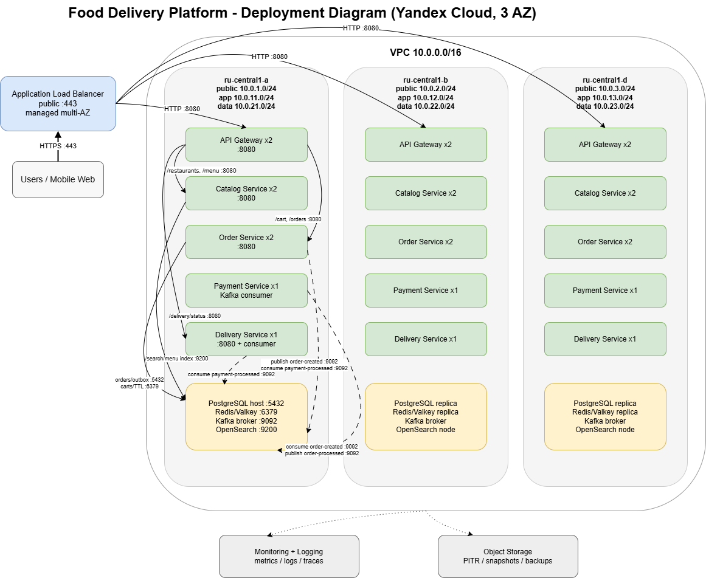

# Deployment Document: Food Delivery Platform

## 1. Архитектура

### 1.1. Назначение

Food Delivery Platform – микросервисная платформа доставки еды: поиск ресторанов, просмотр меню, корзина, оформление заказа, обработка оплаты и назначение курьера. 

Пользовательский revenue critical path: `search restaurants -> get menu -> add to cart -> create order -> payment confirmation`.

Post-order path: `payment-processed -> courier assignment -> delivery status`.

### 1.2. Нагрузка

Данные взяты из `docs/requirements.md`:

| Профиль | Значение |
|---|---:|
| MAU | ~20 000 000 |
| DAU | ~2 000 000 |
| Средний RPS | ~230 RPS |
| Пиковый RPS | ~4 166 RPS |
| Целевой пик по НФТ | до 5 000 RPS |
| Пиковый RPS обновления статусов | до 10 000 RPS |
| Read / Write | ~90 / 10 |
| Заказы | ~400 000 заказов/день |

### 1.3. Deployment diagram

Диаграмма приложена файлами:

- `diagrams/food-delivery-deployment.drawio`
- `diagrams/food-delivery-deployment.png`

### 1.4. Сервисы

| Сервис | Реплики / размещение | Ответственность | Stateful / stateless | Зона |
|---|---:|---|---|---|
| Application Load Balancer | managed, multi-AZ | публичный вход, TLS termination, L7 routing | stateless | public |
| API Gateway | 2 pod/AZ, всего 6 | rate limiting, routing/reverse proxy на внутренние сервисы | stateless | private app subnet |
| Catalog Service | 2 pod/AZ, всего 6 | поиск ресторанов и меню через Elasticsearch/OpenSearch | stateless | private app subnet |
| Order Service | 2 pod/AZ, всего 6 | корзина, создание заказа, запись заказа, transactional outbox, consumer `payment-processed` | stateless app + state in PostgreSQL/Redis | private app subnet |
| Payment Service | 1 pod/AZ, всего 3 | consumer `order-created`, идемпотентная обработка оплаты, publisher `payment-processed` | stateless app + state in PostgreSQL | private app subnet |
| Delivery Service | 1 pod/AZ, всего 3 | consumer `payment-processed`, назначение курьера, выдача статуса доставки | stateless app; durable delivery state должен храниться во внешнем storage | private app subnet |
| PostgreSQL | managed cluster, 3 hosts по AZ | `order_db`, `payment_db`, транзакционные данные | stateful | private db subnet |
| Redis / Valkey | managed cluster, 3 hosts по AZ | корзины, cache, TTL-данные | stateful | private db/cache subnet |
| Kafka | managed cluster, 3 brokers по AZ | события `order-created`, `payment-processed`, saga/outbox | stateful | private streaming subnet |
| Elasticsearch / OpenSearch | 3 data nodes по AZ | индекс ресторанов и меню, geo/full-text search | stateful | private search subnet |

### 1.5. Адресация и сетевые зоны

| Компонент | Production address / port | Комментарий |
|---|---|---|
| Public API | `https://api.food-delivery.example.com:443` | публичный FQDN, указывает на Application Load Balancer |
| Application Load Balancer | public HTTPS `:443` | managed multi-AZ entrypoint, TLS termination, L7 routing |
| API Gateway | `api-gateway.svc.cluster.local:8080` | входной сервис приложения после ALB |
| Catalog Service | `catalog-service.svc.cluster.local:8080` | внутренний HTTP API для ресторанов и меню |
| Order Service | `order-service.svc.cluster.local:8080` | внутренний HTTP API для корзины и создания заказа |
| Delivery Service | `delivery-service.svc.cluster.local:8080` | внутренний HTTP API для post-order статуса и курьеров |
| Payment Service | no public HTTP endpoint | background worker, работает через Kafka consumer/producer |
| PostgreSQL | `postgresql.private:5432` | managed PostgreSQL, private endpoint для `order_db` и `payment_db` |
| Redis / Valkey | `redis.private:6379` | private endpoint для корзин и TTL state |
| Kafka | `kafka.private:9092` | private endpoint, topics `order-created`, `payment-processed` |
| Search cluster | `search.private:9200` | Elasticsearch-compatible endpoint для индекса ресторанов и меню |
| Monitoring / Logging | managed endpoint | сбор метрик, логов и трейсов из private-зоны |
| Object Storage | managed endpoint | backups, snapshots, PITR artifacts |

Public subnet используется только для публичного балансировщика. App subnet содержит stateless HTTP-сервисы и background workers. Data subnet содержит stateful managed-компоненты: PostgreSQL, Redis/Valkey, Kafka и search cluster.

IP pod/instance за autoscaling не указываются: они эфемерны. Для обращения используются DNS-имена Kubernetes services и private endpoints managed-сервисов.

**Сеть:**

| AZ | Public subnet | App subnet | Data subnet |
|---|---|---|---|
| `ru-central1-a` | `10.0.1.0/24` | `10.0.11.0/24` | `10.0.21.0/24` |
| `ru-central1-b` | `10.0.2.0/24` | `10.0.12.0/24` | `10.0.22.0/24` |
| `ru-central1-d` | `10.0.3.0/24` | `10.0.13.0/24` | `10.0.23.0/24` |

## 2. Стратегия деплоя

### 2.1. Стратегии по сервисам

| Сервис | Стратегия | Почему |
|---|---|---|
| API Gateway | Rolling Update | stateless-сервис на публичном request path; несколько реплик позволяют обновлять gateway без остановки входящего трафика |
| Catalog Service | Rolling Update | read-heavy сервис, состояние вынесено в search cluster; безопасно обновляется по репликам |
| Order Service | Canary -> Rolling | critical write path: создание заказа, корзина, запись в PostgreSQL и outbox; новую версию сначала отдаём на 5-10 % трафика |
| Payment Service | Canary / Rolling by consumer group | критичный background worker; нужна постепенная раскатка, контроль duplicate processing и обязательная идемпотентность |
| Delivery Service | Rolling Update | сервис статуса и consumer событий доставки; при обновлении важно корректно переживать Kafka rebalance |
| PostgreSQL migrations | Expand / Contract | rolling/canary означает, что старая и новая версии приложения могут одновременно работать с одной БД |
| Kafka topics | Backward-compatible schema evolution | producer и consumer могут быть разных версий во время деплоя, поэтому события должны оставаться совместимыми |

### 2.2. Zero-downtime контракт

Для HTTP-сервисов:

- `readinessProbe`: `GET /health` или `GET /ready`; сервис получает трафик только после инициализации и подключения к критичным зависимостям.
- `livenessProbe`: лёгкая проверка, что процесс жив и event loop / HTTP server не завис. Не должна падать из-за временной недоступности PostgreSQL, Redis, Kafka или search cluster.
- `startupProbe`: используется для сервисов с долгим init, прогревом или миграционными проверками.
- `preStop` hook и `terminationGracePeriodSeconds: 30-60`.
- graceful shutdown HTTP-сервера: перестать принимать новые запросы, дождаться active requests, закрыть keep-alive connections.
- таймауты на исходящие вызовы: gateway -> service, service -> DB/cache/search.
- retry только для безопасных операций; write-запросы должны иметь idempotency key или другой механизм защиты от дублей.

Для consumer-сервисов:

- корректно закрывать Kafka reader/writer при `SIGTERM`;
- остановить получение новых сообщений перед shutdown;
- завершить обработку уже взятого сообщения;
- commit offset выполнять только после успешной обработки;
- использовать idempotency key для оплаты и обработки заказа;
- добавить retry policy и DLQ для сообщений, которые не удалось обработать после нескольких попыток;
- учитывать Kafka rebalance: обработчик не должен терять сообщение или обрабатывать его небезопасно дважды.

### 2.3. Миграции БД

`Order Service` и `Payment Service` работают с PostgreSQL и требуют контролируемого процесса миграций. Для production миграции лучше запускать отдельно от старта приложения: через Kubernetes Job, CI/CD step или отдельный release step перед rollout сервиса.

Подход Expand / Contract:

1. **Expand:** добавить новые nullable columns, tables или indexes без удаления старых полей.
2. **Deploy app v2:** новая версия умеет работать и со старой, и с новой схемой.
3. **Backfill:** заполнить новые поля фоновым job, если это требуется.
4. **Switch reads:** перевести чтение на новую схему после проверки корректности данных.
5. **Contract:** удалить старые поля только после полного rollout, завершения rollback window и проверки, что старая версия больше не используется.

Правила для миграций:

- не удалять и не переименовывать columns в том же релизе, где код начинает использовать новую схему;
- новые обязательные поля сначала добавлять как nullable или с default value;
- тяжёлые индексы создавать без долгой блокировки таблиц;
- rollback должен быть возможен минимум в течение одного release window;
- миграции должны быть идемпотентными и безопасными для повторного запуска.

Для Kafka events используется backward-compatible evolution:

- добавлять только optional поля;
- не удалять и не переименовывать существующие поля без миграционного периода;
- сохранять совместимость producer/consumer разных версий;
- при breaking changes вводить новую версию события или новый topic;
- consumer должен игнорировать неизвестные поля.

## 3. Observability

Observability target: HTTP-сервисы и Kafka workers должны экспортировать RED/USE-метрики, структурированные JSON-логи и trace context. В текущей кодовой базе уже есть `/health` endpoints и понятный request path, но production-метрики, JSON-логи и tracing должны быть добавлены отдельным instrumentation layer.

### 3.1. Алерты на critical path

Ровно 4 алерта: Latency, Errors, Traffic и Saturation.

| Сигнал | Что измеряем | Порог и окно | Где срабатывает |
|---|---|---|---|
| Latency | p99 latency на revenue critical HTTP endpoints: search restaurants, get menu, add cart, create order | p99 > 800 ms в течение 5 минут | API Gateway, Catalog Service, Order Service |
| Errors | доля HTTP 5xx на revenue critical endpoints | 5xx rate > 1 % в течение 5 минут | API Gateway, Order Service, Catalog Service |
| Traffic | входящий RPS на API Gateway | > 5 500 RPS 10 минут или резкое падение ниже ожидаемого baseline в рабочий пик | API Gateway |
| Saturation | Kafka consumer lag по `order-created` и `payment-processed` | lag > 10 000 сообщений в течение 10 минут | Kafka, Payment Service, Order Service, Delivery Service |

### 3.2. Дашборды

**Overview dashboard:** один экран для дежурного.

- общий RPS по API Gateway;
- p50/p95/p99 latency по critical endpoints;
- 4xx/5xx rate;
- успешные заказы в минуту;
- payment success/fail rate;
- courier assignment rate;
- Kafka consumer lag по `order-created` и `payment-processed`;
- состояние PostgreSQL, Redis/Valkey, Kafka и search cluster.

**Service-level dashboard:** RED по каждому сервису.

- Rate: HTTP RPS по endpoint или message rate для Kafka workers;
- Errors: 4xx, 5xx, business errors, consumer retry/fail;
- Duration: p50/p95/p99 latency для HTTP и processing time для consumers;
- dependency calls: service -> DB/cache/search/Kafka;
- deploy version, pod restarts, readiness failures.

**Diagnostic dashboard:** USE + traces.

- CPU, memory, disk IO, network IO по pod/node;
- PostgreSQL: connections, locks, slow queries, replication lag, WAL size;
- Redis/Valkey: memory used, evictions, hit ratio, latency;
- Kafka: broker CPU/disk, ISR, under-replicated partitions, consumer lag;
- search cluster: heap, GC, query latency, index size, rejected requests;
- distributed traces по `POST /api/v1/orders`;
- dependency breakdown для revenue path: Gateway -> Order Service -> PostgreSQL/Redis/Kafka -> Payment Service;
- отдельный trace/status flow для post-order path: Kafka -> Delivery Service -> delivery status API.

### 3.3. Логи

Целевой формат: JSON в stdout. Сбор: Fluent Bit / Cloud Logging agent -> centralized storage.

Обязательные поля:

| Поле | Зачем |
|---|---|
| `timestamp` | время события |
| `level` | `debug/info/warn/error` |
| `service` | имя сервиса |
| `version` | версия образа / git sha |
| `trace_id` | связка запроса по сервисам |
| `span_id` | связка внутри trace |
| `request_id` | id входящего HTTP-запроса |
| `method`, `path`, `status_code` | HTTP-контекст |
| `latency_ms` | длительность обработки |
| `customer_id_hash` | безопасная корреляция без PII |
| `order_id` | бизнес-корреляция для заказа |
| `kafka_topic`, `kafka_partition`, `kafka_offset` | диагностика consumer/producer |
| `error`, `stacktrace` | диагностика ошибок |

Что логируем:

- входящий request summary;
- исходящий call summary: dependency, status, latency;
- создание заказа;
- публикацию outbox event;
- обработку `order-created` и `payment-processed`;
- ошибки со stack trace;
- retry и DLQ events;
- rate-limit события на gateway.

Что не логируем:

- пароли, токены, ключи, `POSTGRES_PASSWORD`, connection strings;
- полные адреса доставки, телефоны, email, платежные данные;
- полное тело запроса с PII;
- PAN/CVV и любые реальные данные карты.

## 4. Доступность

### 4.1. Целевая доступность

Целевая доступность задаётся отдельно для разных частей системы:

| Path | Target availability | Почему |
|---|---:|---|
| Payment path | 99.99 % | оплата напрямую связана с деньгами, идемпотентностью и доверием пользователей |
| Order creation path | 99.95 % | оформление заказа создаёт выручку; простой быстро превращается в потерянные заказы |
| Catalog path | 99.9 % | read-heavy часть, может деградировать через cache/fallback |
| Post-order status path | 99.9 % | важен для UX и поддержки, но не должен блокировать создание и оплату заказа |

Обоснование:

- оформление заказа и оплата напрямую создают выручку;
- пользователи доставки ожидают стабильную работу в обеденный и вечерний пики;
- каталог может деградировать мягче: cached results, ограниченный список ресторанов, degraded search;
- post-order status важен для UX и поддержки, но его временная деградация не должна приводить к потере созданного или оплаченного заказа.

Оценка допустимого простоя:

| Availability | Допустимый простой / месяц | Комментарий |
|---:|---:|---|
| 99.9 % | ~43.2 минуты | каталог, post-order status |
| 99.95 % | ~21.6 минуты | создание заказа |
| 99.99 % | ~4.3 минуты | payment path |

Оценка потерь при простое:

Используем бизнес-допущения из capacity estimation:

- `400 000` заказов/день;
- `400 000 / 24 / 60 ~ 277` заказов/минуту в среднем;
- средний чек принимаем равным `900 руб.`;
- потеря GMV за 1 минуту полного простоя order/payment path:

277 заказов/мин * 900 руб. ~ 249 300 руб./мин, поэтому важно вложиться в архитектуру.

### 4.2. RPO / RTO

| Компонент | RPO | RTO | Почему |
|---|---:|---:|---|
| PostgreSQL `order_db` | <= 1 мин | <= 15 мин | потеря заказа недопустима; нужны WAL archiving, PITR и репликация across AZ |
| PostgreSQL `payment_db` | <= 1 мин | <= 10 мин | платежи критичнее всего; нужны PITR, audit trail и идемпотентная обработка |
| Kafka | <= 5 мин | <= 15 мин | события можно переиграть из outbox, но большой lag ломает order/payment saga |
| Redis / Valkey carts | <= 15 мин | <= 10 мин | корзина важна для UX, но не является финансовым source of truth |
| Search cluster | <= 24 ч | <= 30-60 мин | индекс можно восстановить из source данных; допустима деградация поиска |

Комментарии:

- `order_db` и `payment_db` являются source of truth для заказов и платежей.
- Kafka не должен быть единственным местом хранения бизнес-событий: для восстановления используется transactional outbox и идемпотентные consumers.
- Redis хранит временное состояние корзин; потеря части корзин неприятна, но не равна потере оплаченного заказа.
- Search cluster можно пересобрать из источника данных, поэтому требования к RPO мягче.
- Для post-order status path durable state должен храниться во внешнем storage; сам Delivery Service остаётся stateless worker/API.

### 4.3. Резервирование

| Компонент | Стратегия | Геораспределение |
|---|---|---|
| App services | active/active по 3 AZ | внутри одного региона достаточно для target 99.95 % |
| PostgreSQL `order_db` | primary + replicas across AZ, automated backups, PITR | cross-region backup optional |
| PostgreSQL `payment_db` | primary + replicas across AZ, PITR, отдельная backup policy и audit retention | желательно cross-region backups |
| Kafka | 3 brokers, replication factor 3, min ISR 2 | cross-region replication не требуется на текущем этапе |
| Redis / Valkey | managed HA cluster по 3 AZ | без cross-region |
| Search cluster | 3 nodes, shard replicas across AZ, periodic snapshots | cross-region snapshots optional |
| Object Storage backups | versioning, lifecycle policy, restricted access | можно хранить копию backup в другом регионе/бакете |

### 4.4. Maintenance window

Пользовательский API должен обновляться без объявленного downtime: обычные релизы проходят через rolling/canary deployment.

Плановое maintenance window допускается только для рискованных операций с данными: крупные миграции, backfill, изменение схемы хранения, восстановление индексов.

Правила окна:

- воскресенье 03:00-05:00 MSK;
- не чаще 1 раза в месяц;
- заранее уведомлять команду и бизнес;
- перед окном: backup, rollback plan, freeze на релизы;
- после окна: smoke tests, проверка SLO и revenue critical path: search -> cart -> order -> payment;
- extended smoke test для post-order flow: payment-processed -> courier assignment -> delivery status.

## 5. TCO в Yandex Cloud

### 5.1. Что считаем

Считаем только компоненты, которые есть в целевой архитектуре проекта:

- compute для микросервисов;
- PostgreSQL;
- Redis-compatible KV-cache / Valkey;
- Kafka;
- OpenSearch-compatible search cluster;
- Application Load Balancer;
- Object Storage для backups/snapshots/log archive;
- Monitoring + Logging;
- network egress reserve.

Не считаем CDN, внешнего платёжного провайдера, SMS/push/email и зарплаты разработки, потому что они не входят в deployment-архитектуру сервиса.

Источник цен: Yandex Cloud Pricing / Calculator на дату подготовки документа. Точность до рубля не требуется: ниже указан порядок величин. Итоговые значения зависят от валюты договора, курса, выбранных host classes, дисков, retention и реального сетевого трафика.

### 5.2. Допущения для расчёта

| Параметр | Current | 2x traffic | 5x traffic |
|---|---:|---:|---:|
| Peak RPS | ~5 000 | ~10 000 | ~25 000 |
| App workers | 3 x 4 vCPU / 8 GB | 6 x 4 vCPU / 8 GB | 15 x 4 vCPU / 8 GB |
| PostgreSQL | 3 x medium hosts, 100 GB | 3 x larger hosts, 200 GB | 3 x large hosts, 500 GB |
| Valkey / Redis-compatible cache | 3 x 2 vCPU / 8 GB | 3 x 4 vCPU / 16 GB | 6 x 4 vCPU / 16 GB |
| Kafka | 3 brokers + service metadata nodes | 3 larger brokers + metadata nodes | 6 brokers + metadata nodes |
| Search | 3 OpenSearch nodes | 6 OpenSearch nodes | 12 OpenSearch nodes |
| ALB resource units | 6-8 | 10-12 | 25-30 |
| Logs | 3 TB / 30 days | 6 TB / 30 days | 15 TB / 30 days |
| Backups/snapshots | 0.5-1 TB | 1-2 TB | 3-5 TB |

### 5.3. Infrastructure cost estimate

| Компонент | Current, руб./мес | 2x traffic, руб./мес | 5x traffic, руб./мес |
|---|---:|---:|---:|
| App compute / VM workers | ~20 400 | ~40 800 | ~102 000 |
| Managed PostgreSQL | ~21 500 | ~43 000 | ~107 500 |
| Managed Valkey | ~18 800 | ~37 600 | ~94 000 |
| Managed Kafka | ~26 700 | ~45 000 | ~90 000 |
| Managed OpenSearch | ~9 000 | ~18 000 | ~45 000 |
| Application Load Balancer | ~10 000 | ~20 000 | ~50 000 |
| Object Storage backups/snapshots | ~2 400 | ~4 800 | ~12 000 |
| Monitoring + Logging | ~20 000 | ~40 000 | ~100 000 |
| Network egress reserve | ~5 000 | ~10 000 | ~25 000 |
| **Итого инфраструктура** | **~133 800** | **~259 200** | **~625 500** |

### 5.4. Операционные затраты

| Статья | Current, руб./мес | 2x traffic, руб./мес | 5x traffic, руб./мес |
|---|---:|---:|---:|
| On-call компенсация | ~80 000 | ~120 000 | ~180 000 |
| Обслуживание БД/очередей/search | ~60 000 | ~100 000 | ~180 000 |
| Observability review / SLO review | ~20 000 | ~35 000 | ~60 000 |
| **Итого ops** | **~160 000** | **~255 000** | **~420 000** |

### 5.5. Итоговый TCO

| Сценарий | Infra, руб./мес | Ops, руб./мес | Total, руб./мес |
|---|---:|---:|---:|
| Current | ~133 800 | ~160 000 | **~293 800** |
| 2x traffic | ~259 200 | ~255 000 | **~514 200** |
| 5x traffic | ~625 500 | ~420 000 | **~1 045 500** |

Самое дорогое:

1. **App compute и stateful managed services:** при росте трафика stateless workers масштабируются почти линейно, а PostgreSQL, Valkey и Kafka требуют запас по CPU/RAM/storage и репликацию.
2. **PostgreSQL и Kafka:** это ключевые компоненты order/payment flow; экономить на них опаснее, чем на stateless-сервисах.
3. **Monitoring + Logging:** при больших объёмах логов эта статья может быстро вырасти. Нужны sampling, retention policy и запрет debug-логов в normal mode.
4. **Search:** OpenSearch нужен для read-heavy поиска ресторанов и меню, но его можно масштабировать отдельно от write-path.